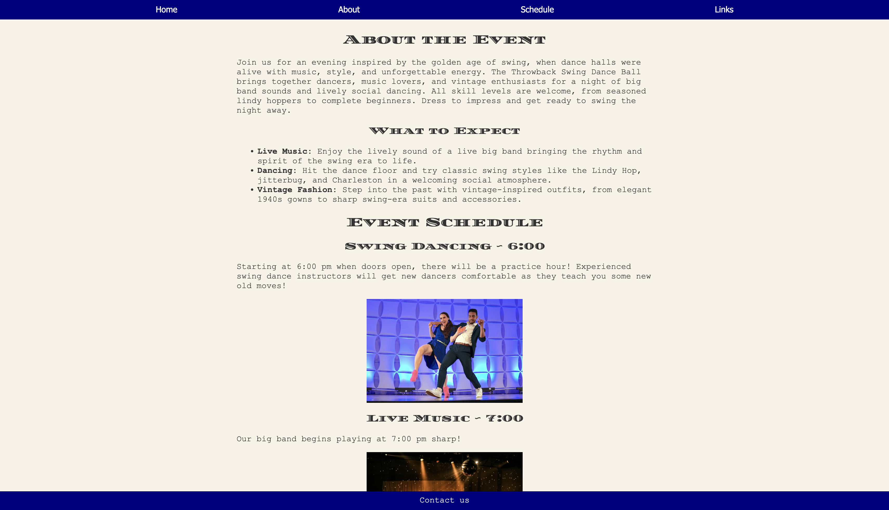

# 🎷 Throwback Swing Ball Website

A retro-inspired event webpage built for CodePath WEB101.
JavaScript will be added at a later date.

## ✨ Features

- Vintage poster-inspired design
- Interactive hover effects (cards, buttons)
- Layered visual elements (starbursts, images)
- Custom color palette and typography

## 🎨 Inspiration

Originally started with a 1940s theme, then redesigned after discovering mid-century swing dance poster styles, hence why the stylesheet is named "styles3.css". The original styling leaned heavier into a war-time, early-to-mid 40s aesthetic in terms of the font and color choice:

I decided, after looking to 1940s jazz posters, to lean heavier into a late 40s, early 50s design that I felt was more fun and lively for the event. I also used more imagery in the background, similar to mid-century posters and ads.

## 🛠️ Tech Used

- HTML
- CSS (Flexbox, styling, hover interactions)
- ChatGPT for image generation

## 🚀 What I Learned

- How to translate visual inspiration into design
- The importance of iteration in creative projects
- Using CSS to create depth and interactivity